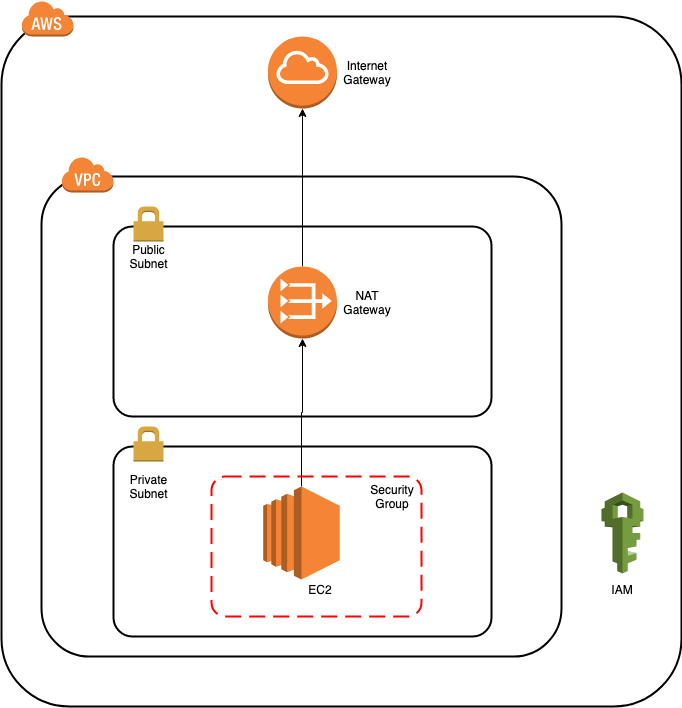

# Basic AWS infrastructure using Terraform

This script will setup the basic AWS infrastrcuture with Terraform. The following components will be setup:
-  AWS VPC with one public subnet and one private subnet
-  NAT Gateway
-  Internet gateway
-  EC2 instance with Ubuntu AMI in private subnet
  


## Pre-requisite
- AWS EC2 key pair in the AWS region (This uses 'us-east-1' AWS region)

## Setup
- Get the public key for EC2 key pair
Use the below command to retrieve the public key of EC2 key pair
    ```
    ssh-keygen -y -f /path/to/privatekey > /path/to/publickey
    ```

- Checkout the code
    ```
    git clone https://github.com/abhishekjawali/terraform-aws-basic.git
    ```

- Replace the value of "ec2_public_key" in "terraform.tfvars" file

- Create stack
    ```
    terraform apply
    ```
    
## Cleanup
```
terraform destroy
```